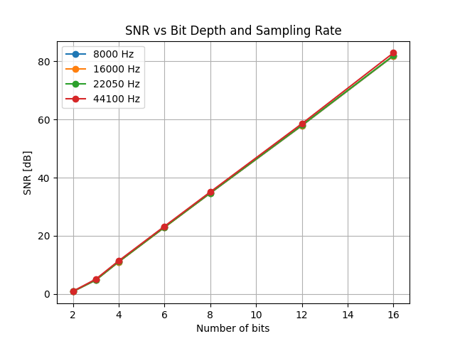
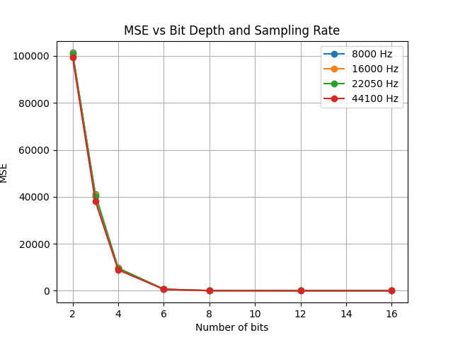

## Conclusion:
- The best sound quality is achieved at 44100 Hz sampling rate with 16-bit quantization.
- There is no perceptible difference in audio quality between 8-, 12-, and 16-bit versions (at least to the human ear).
### SNR Plot

- SNR increases linearly with the number of bits, regardless of the sampling rate.
### MSE Plot

- MSE is very high at 2-bit quantization, but drops exponentially – from 6 bits onward, the quality is close to original and at 8 bits it is nearly indistinguishable.
